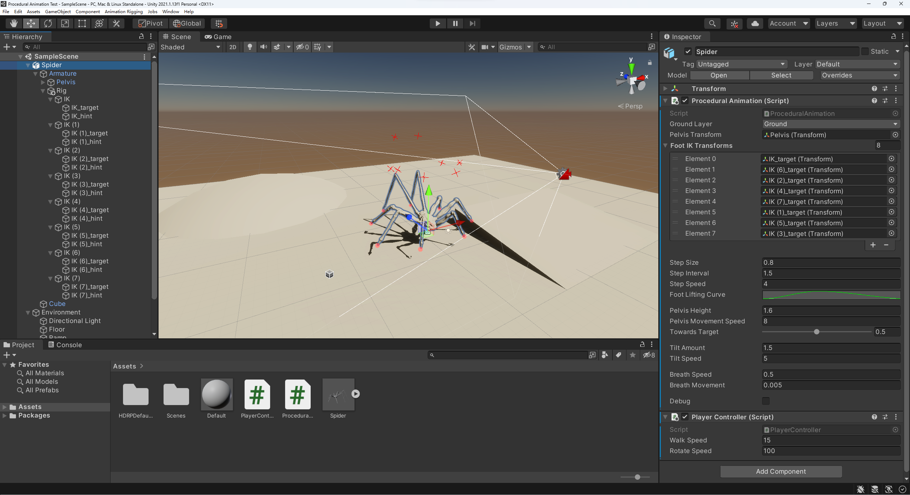

# Procedural Animation

A quick test of procedural animation in Unity, inspired by ["Step by Step" Procedural Animation - YouTube](https://www.youtube.com/watch?v=vKiqs_h1WXM). 

The spider model can be obtained from the YouTube link.

## How to use

1. Add Animation Rigging package to your project, and set up a two-bone IK constraint for each foot of your model. The exact process is described in the first half of [Procedural Animation tutorial - YouTube](https://www.youtube.com/watch?v=eTERzR4Yu5U&t=309s).

2. Drag the script to your "Spider", and link all IK targets to the script.
3. Add a Rig Transform to the "Pelvis" bone (or similar bone in your model). Drag the "Pelvis" bone to the "Pelvis Transform" parameter from the script.
4. Add a LayerMask to your environment, and set the script parameter accordingly.
5. Modify the code/parameters to suit your needs. My settings are shown below as a reference. 

